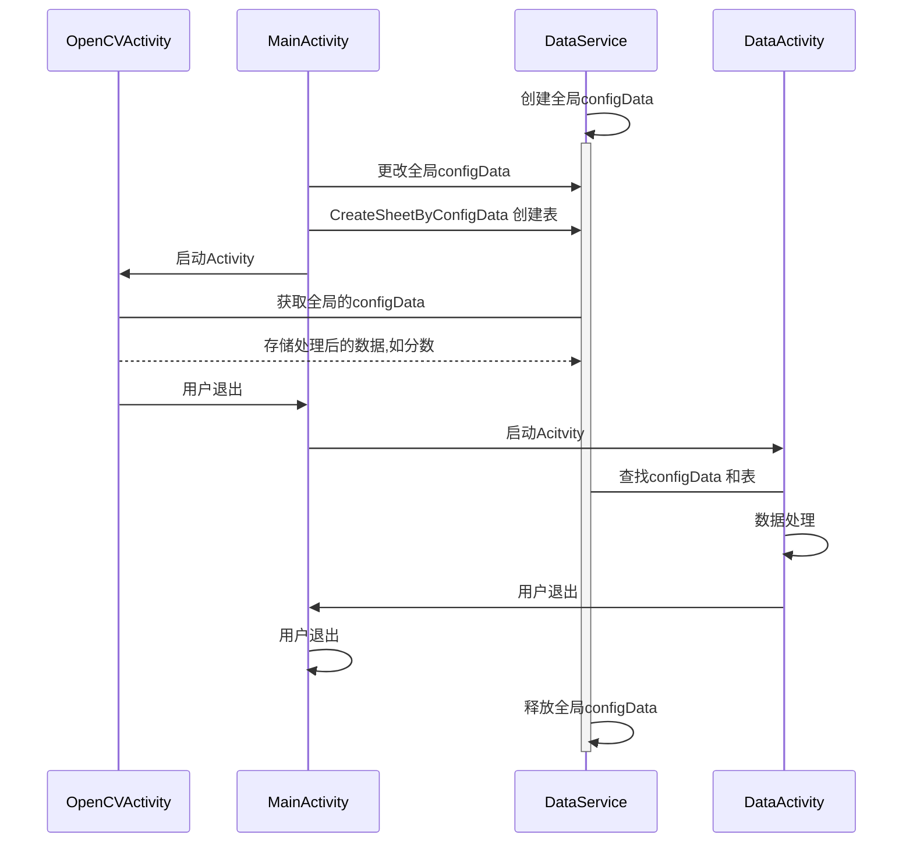

# 前言:
首先总结一下这两周干了啥,其次总结一个项目是因为之前做的答题卡识别由于大多数是静态的,导致有多张答题卡识别错误,而且由于我所使用的是定点切割的简单方法,导致答题卡识别的效率还是很地下,考虑到大多数在拍照的情况下多人都是使用的手机,因此开发一个App就很重要了.同时我也想要优化一下算法,所以这两周一直在忙着开发这个App.

# 1.项目简介
开发的项目主要是应用与答题卡,但是我想将功能扩展一下,进行一些数据处理,所以设计了以下模式:


# 2.OpenCV Android 的配置和使用
## 配置
根据opencv官方给的参考文章: https://docs.opencv.org/4.x/d5/df8/tutorial_dev_with_OCV_on_Android.html

### 下载opencv for android 的发布版
前往opencv所提供的发布地址: https://github.com/opencv/opencv/releases
下载发布版本 我这里使用的OpenCV 5.0.0-alpha  下载https://github.com/opencv/opencv/releases/download/5.0.0-alpha/opencv-5.0.0-alpha-android-sdk.zip
然后解压存储到一个目录下
### 导入opencv 模块
打开Android Studio 选项版下: File -> New -> Import Module.. 导入上一步所解压的目录的sdk文件夹,后修改一下配置文件: 配置文件在sdk目录下的build.gradle文件,由于我使用的是kotlin写的app所以要在文件里加入
```gradle
plugins{
    id 'org.jetbrains.kotlin.android' version '1.9.24'
}
```
后修改 java版本 我这里改为 java11

