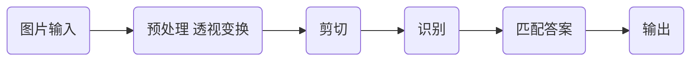

## 简述

使用opencv numpy 来进行答题卡识别,方法有很多种,比如使用边缘检测,特征检测,但是在我之前尝试过的效果都不甚理想,示例图如下: {: w="600" h="900"}
所以自己用一些很简单的方法进行计算识别 写篇文章简单记录一下

## 算法概述
流程图概述

### 批注:
  预处理在我这里仅仅是将图片进行了**色度转换** `cv.cvtColor(img,cv2.COLOR_BGR2GRAY)`和**透视变换**然后输出了平整图片,这边算法网上很多,可自行查找,这里就不赘述. 然后剪切,这里为了方便操作直接采用**定点剪切**,这里也不赘述.最后输出图像如下例子:
{: w="300" h="300"}

### 算法
  我们可以看到每张剪切好的答题卡实际上都是一些同样图像的横竖的阵列,且很普通的是刚好都是相对于 x,y坐标轴垂直对齐的,那么就很简单了.首先是对每一像素横列进行加和:
$$
  img[x,y] >= 125 \Rightarrow g(x,y) = 1 
$$

$$
  img[x,y] < 125 \Rightarrow g(x,y) = 0 
$$

$$
  f(y) = \sum_{x}^{width} g(x,y) 
$$


代码如下:

```python
def MakeGradeX(img):
    img_:cvT.MatLike = cv2.resize(img,(int(img.shape[1]/img.shape[0]*200),200))
    _, img_ = cv2.threshold(img, 0, 255, cv2.THRESH_BINARY | cv2.THRESH_OTSU)
    mat_ = cv2.bitwise_and(mat,1)    
    ret = np.ndarray(mat_.shape[0],dtype=np.int16)
    for i in range(mat_.shape[0]):
        ret[i] = np.sum(mat_[i,:])
    # 白底黑字,反转一下:
    s = np.max(ret)
    ret = s-ret
    # 卷积相乘,平滑获得到的数列
    struc = np.array([1,2,8,2,1])
    ret = np.convolve(ret,struc,mode="same")
    return ret
```
对所获取到的结果进行二值化然后制作梯度就可以了,然后根据梯度切分就可以了
```python
  ret = np.where(ptm>np.average(ptm),1,0)
  grade_ = np.ndarray(ret.shape[0]-1,dtype=np.int16)
  for i in range(ret.shape[0]-1):
        grade_[i] = ret[i+1] - ret[i]
  a = np.array( np.where(grade_==1),dtype=np.float32)
  b = np.array( np.where(ptm==-1),dtype=np.float32)
  a = a/200 * img.shape[0]
  b = b/200 * img.shape[0]
  clips = []
  for k in range(a.shape[1])
          clips.append(img[int(a[0,k]):int(b[0,k])])

```
对于后续的另一个方向的检测算法基本一致,不再赘述.到这里我们基本就能获取每一个选项的坐标位置,并且还算精准,后续可以进行一些优化,后面进行答案识别和结果输出就可以了.
最后代码存储库:[存储库](https://github.com/dpiolan/AnswerCard)
